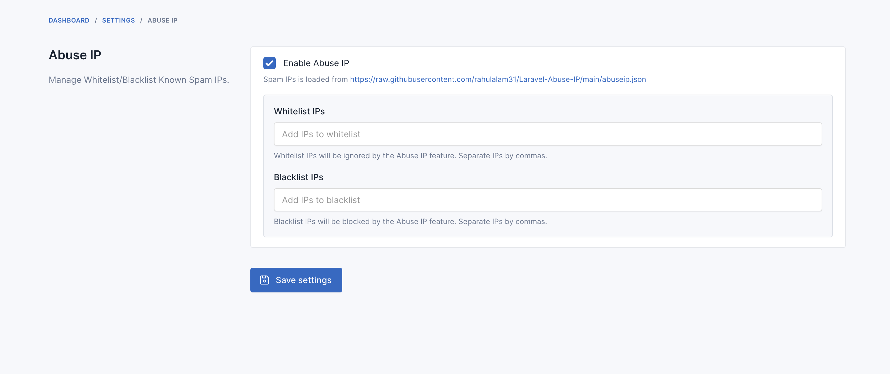
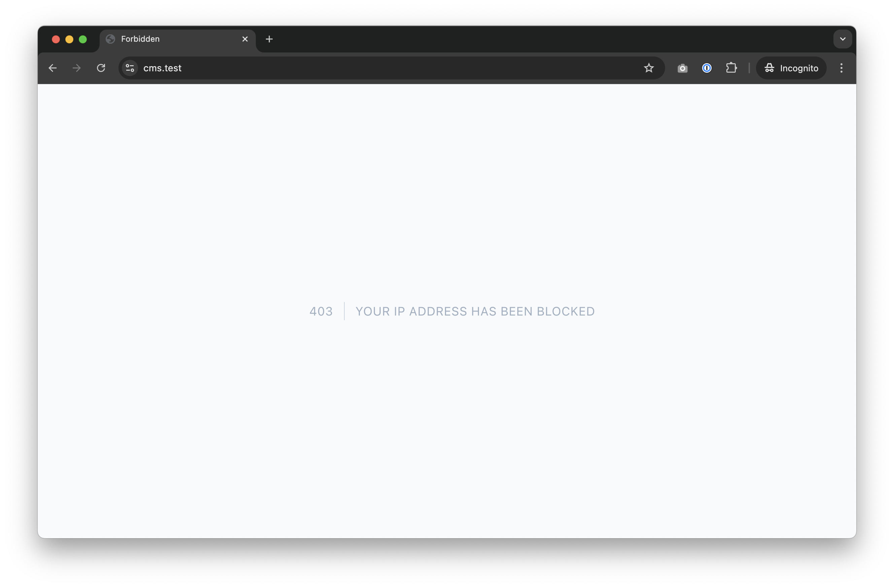

# AbuseIP - Preventing spam submitted through forms

Adds a Security to your Botble website for checking whether the IP address is safe or marked as spam to keep you out of worry from spammers and fake data to your website. Uses the DB blocklist from 
[borestad/blocklist-abuseipdb](https://github.com/borestad/blocklist-abuseipdb) by default.

Refs: [rahulalam31/Laravel-Abuse-IP](https://github.com/rahulalam31/Laravel-Abuse-IP)

## Requirements

-   Botble core 7.2.0 or higher.

## Installation

### Install via Admin Panel

Go to the **Admin Panel** and click on the **Plugins** tab. Click on the "Add new" button, find the **AbuseIP** plugin and click on the "Install" button.

### Install manually

1. Download the plugin from the [Botble Marketplace](https://marketplace.botble.com/products/friendsofbotble/fob-abuse-ip).
2. Extract the downloaded file and upload the extracted folder to the `platform/plugins` directory.
3. Go to **Admin** > **Plugins** and click on the **Activate** button.

## Changelog

Please see [CHANGELOG](CHANGELOG.md) for more information what has changed recently.

## Contributing

Please see [CONTRIBUTING](CONTRIBUTING.md) for details.

## Security

If you discover any security related issues, please email friendsofbotble@gmail.com instead of using the issue tracker.

## Credits

-   [Friends Of Botble](https://github.com/FriendsOfBotble)
-   [All Contributors](../../contributors)

## License

The MIT License (MIT). Please see [License File](LICENSE) for more information.
